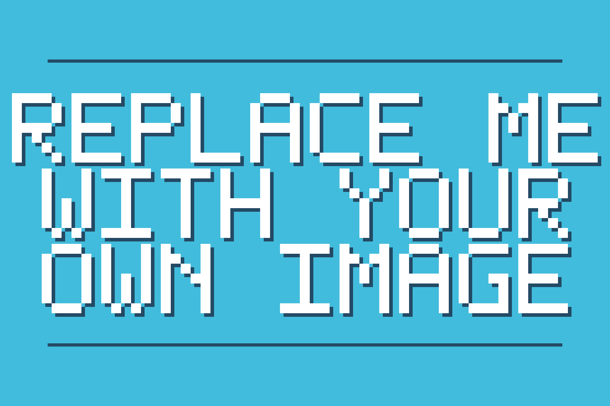
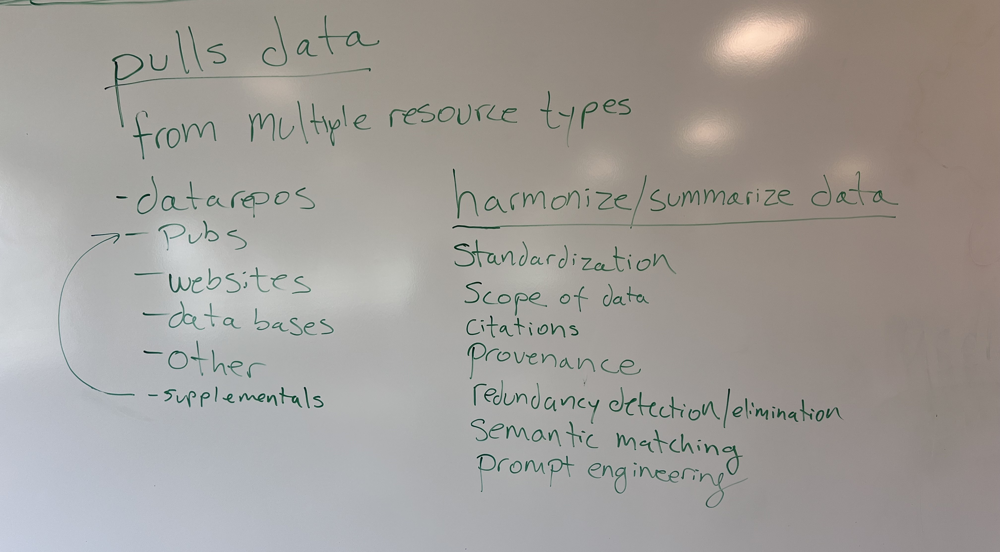
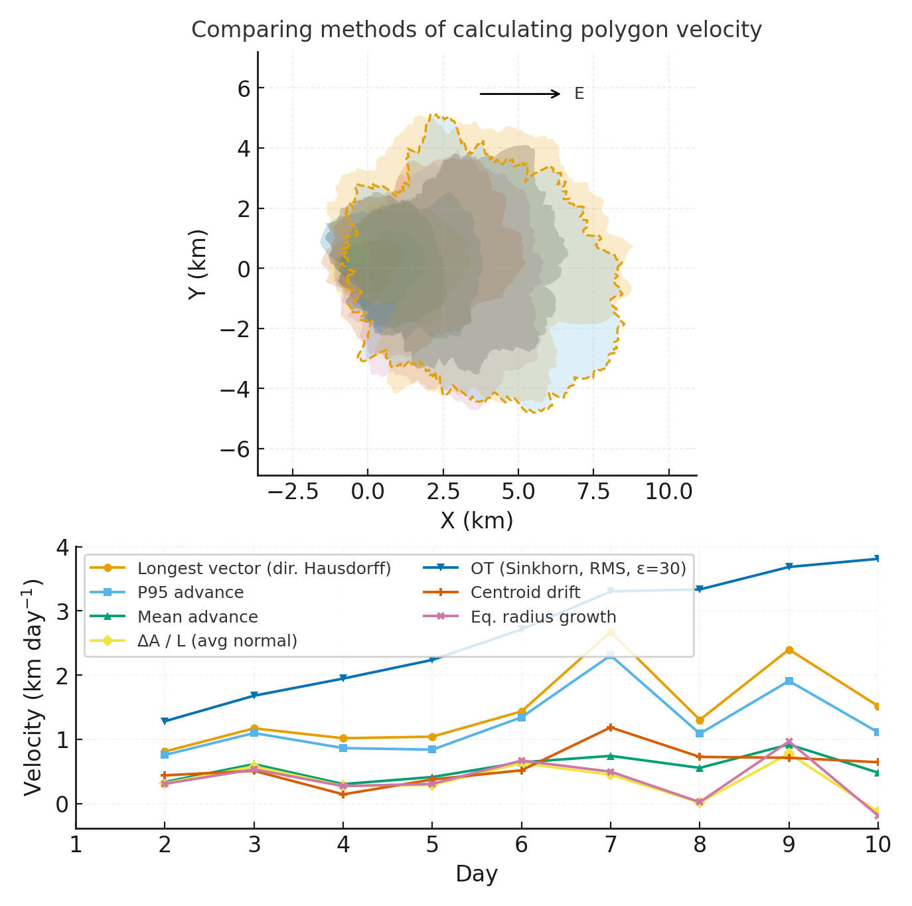
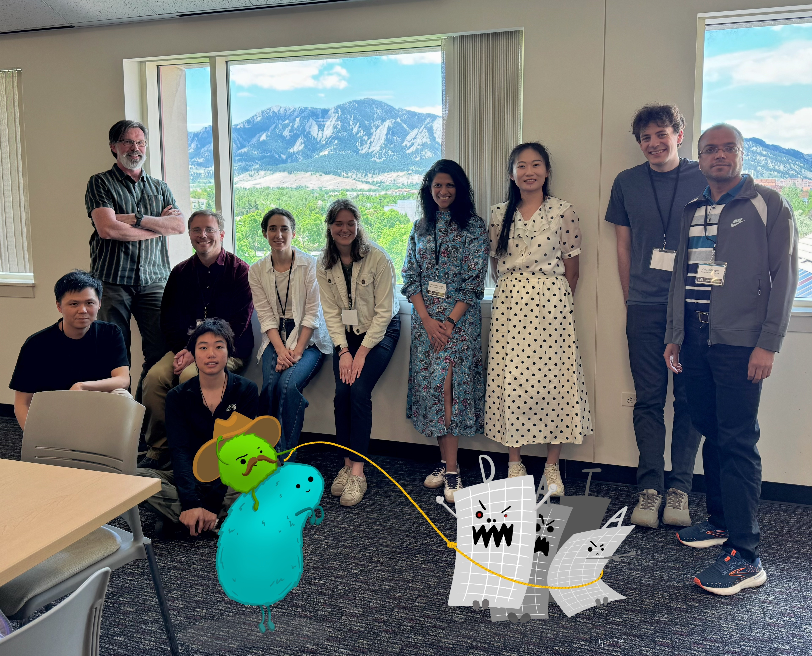

!!! tip "How to use this page during the Summit"
    - This page is your team’s shared workspace and final report-out page. It captures your group’s process and thinking throughout the Summit and will be used to share your work with others.
    
    - Use this page as your team’s working record during the Summit and your final report-out.
    
    - The Summit has several different goals and thus you will use the page differently each day: Day 1 is for alignment, Day 2 is for building one useful thing, and Day 3 is for synthesis and report- out.
    
    - Look for the green buttons to indicate what you need to edit. 
    
    - Megaphones 📣 indicate which items you will be presenting during the end-of-day report-outs.

    - Only the items with megaphones will be visible when you hit the 'Summit Report Out' button. 

    - If you turn off 'Instructions' then you will only see the page content for public display.
    

# Data Buffs: Wrangling Data using Language Models

!!! tip "For ESIIL staff"
    Group Number: 4
    
    Breakout Room #: ESIIL Table

    [ESIIL staff edit in Markdown](https://github.com/CU-ESIIL/Summit_group_2026_4/edit/main/docs/index.md?plain=1#L28){ .md-button target="_blank" rel="noopener" }
    

Credit: Allison Horst

## People { #people .oasis-report-out-context }

| Name | Affiliation | Contact | Github |
|---|---|---|---|
| Andy Wilson | Denver Botanic Gardens | andrew.wilson@botanicgardens.org | MycoMisfit |
| Qinghua Zhao | University of Notre Dame | qinghua.w.zhao@outlook.com | QZhao16 |
| Lucas Mansfield | Michigan State University | mansfi79@msu.edu | lmansf44 |
| Jenna Baljunas | Michigan State University | baljunas@msu.edu | Jbaljunas |
| Rick Levy | Denver Botanic Gardens | richard.levy@botanicgardens.org | ricklevy21 |
| Savini Samarasinghe | Illinois State Water Survey  | savinis@illinois.edu  | savinims |
| Qingyu Gan | University of Wyoming | ganjiuyue@gmail.com | qingyu1gan |
| Mengying Zhang | Clemson University | mengyiz@clemson.edu | mengying1999-git |
| Chhabilal Regmi | Navajo Technical University | c.regmi@navajotech.edu |c.regmi@navajotech.edu |
| Julia Sanguinetti | Ingredion | julia.sanguinett@gmail.com | juliasng |

## Team Norms and Decision Making { #team-norms-and-decision-making }

### Our team norms:

- Actively listen to each other and take into account each persons ideas
- Each member will have a role and responsibility within the team
- Each member will treat each other member with respect
- Commits will be detailed and filled in to track versions

### Our decision making strategy:

- We will hold a group discussion, hear ideas from each member, and vote to select a path forward.

## Our product(s) 📣 { #product-direction .oasis-report-out-section .oasis-report-out-day2 }

### Short term:

 - Generalized workflow for using AI agent to find, extract and harmonize data from diverse resource types to answer questions in environmental science, with an included example case study.

### Long term:

- Methods/Perspective paper regarding AI-enabled workflow, including case studies from various fields and with various outputs. 

*Morning whiteboard or notes showing the question, hypotheses, and context we used to start Day 2.*

## Our question(s) 📣 { #project-question .oasis-report-out-section .oasis-report-out-day2 }

### Our working question:

- How can we create an agent-based workflow that harmonizes many different kinds of data, from different fields of interest for the purpose of assembling a meta dataset for analysis?

### What would count as progress:

- An AI Agent that can read in a single PDF file and extract, organize and sort its data. This will be the first step towards downstream itterations where data from multiple publications will be made available for developing the Agent's ability to harmonize and combine the invormation into a single meta-dataset. 

## Hypotheses/Intentions [Optional: probably not relevant if you are creating an educational tool]

## Why this matters (the “upshot”) 📣 { #why-this-matters .oasis-report-out-section .oasis-report-out-day2 }

### This matters because:

- This work would enable more effecient data synthesis and harmonization for researchers to perform large-scale meta-analyses across scales and disciplines.
- It also provides the ability to create larger datasets from disparate sources.

### People who could use this:

- This work would have applications across the environmental sciecnes (e.g. biogeography, fire ecology, aquatic systems, atmospheric chemistry, epidemiology, etc.), but could also be easily adapted to a variety of academic disciplines (e.g. materials science, sociology, psychology, physics, etc.).
- This workflow could be applied by researchers with little experience in the computer sciences or AI technology.

## Data sources we’re exploring 📣 { #data-exploration .oasis-report-out-section .oasis-report-out-day2 }

!!! note "data exploration"
    Provide a snapshot showing some initial data patterns. 

    Add 2-4 promising data sources (links +1-line notes)    

*Snapshot showing initial data patterns.*

Promising data sources:

- Journal: [*PLOS One*](https://journals.plos.org/plosone/)
- Data Repo: [Zenodo](https://zenodo.org/)
- Data Repo: [Dryad](https://datadryad.org/) 

## Methods/technologies we’re testing 📣 { #methods-and-code .oasis-report-out-section .oasis-report-out-day2 }

!!! note "methods"
    Add 2-4 methods/technologies we're testing (stats, models, viz).

[View shared code](https://github.com/CU-ESIIL/Summit_group_2026_4/tree/main/code){ .md-button }

Methods/technologies we are testing:

| Method or technology | What we tested | Early note |
|---|---|---|
| Agentic AI | ... | ... |
| Semantic Matching of Data | ... | ... |
| Redundancy Detection/Elimination | ... | ... |

### Challenges identified

- ...
- ...

### Visuals

### Next Steps

Short term: 

Long term: 

!!! note "Day 3 Tasks"
    Sythesis: highlight 2-3 visuals that tell the story; keep text crisp. Practice a 6-minute walkthrough of the homepage. Why -> Questions -> Data/Methods -> Findings -> Next 

    [Edit content below here in Markdown](https://github.com/CU-ESIIL/Summit_group_2026_4/edit/main/docs/index.md?plain=1#L203){ .md-button target="_blank" rel="noopener" }

## Team Photo { #team-photo }

*Team members and collaborators who contributed to this project.*

## Findings at a glance 📣 { #findings-at-a-glance .oasis-report-out-section .oasis-report-out-day3 }

Headline 1 — what, where, how much

...

Headline 2 — change/trend/contrast

...

Headline 3 — implication for practice or policy

...

## Visuals that tell a story 📣 { #story-visuals .oasis-report-out-section .oasis-report-out-day3 }

*Visual 1: the main pattern or output we want people to remember.*

## What’s next? 📣 { #whats-next .oasis-report-out-section .oasis-report-out-day3 }

Short term:

- ...

Long term:

- ...

Who should see this next

- ...

## Cite & Reuse { #cite-reuse }

If you use these materials, please cite:

Summit Team. (2026). *Summit Group 2026 Team 4 — Innovation Summit 2026*. https://github.com/CU-ESIIL/Summit_group_2026_4

License: CC-BY-4.0 unless noted. 
